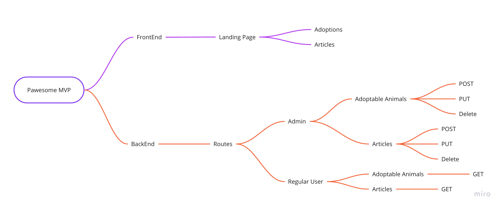

# Pawesome

Pawesome will be a pet adoption site for a shelter.

## As a regular user you'll be able to

- Browse for animals that are up for adoption
- Apply to adopt an animal
- Find articles on how to prepare for adopting a new pet
- Apply to volunteer at the shelter
- Donate to the shelter

## As an admin you'll be able to

- Add animals to the database of adoptable animals
- Edit information about animals currently on the database
- Add articles about your shelter, pet adoption tips, etc.
- Take donations
- Review adoption and volunteer applications

## Purpose

- To build a platform shelters can use to help boost adoptions and make things easier to manage.
- To improve on existing skills and learn some new ones.

### Tech Stack I already know

- React.js
- Node.js
- Express.js
- Stripe API

### Tech Stack I want to learn

- MongoDB
- GraphQl
- Tailwind CSS

### MVP

- Regular users can navigate from the landing page to animals that are up for adoption and articles posted by site admins
- Admin users can add animals to the adoption database, make edits to existing animals info/adoption status, and add/edit articles

### Pawesome Mind Map

